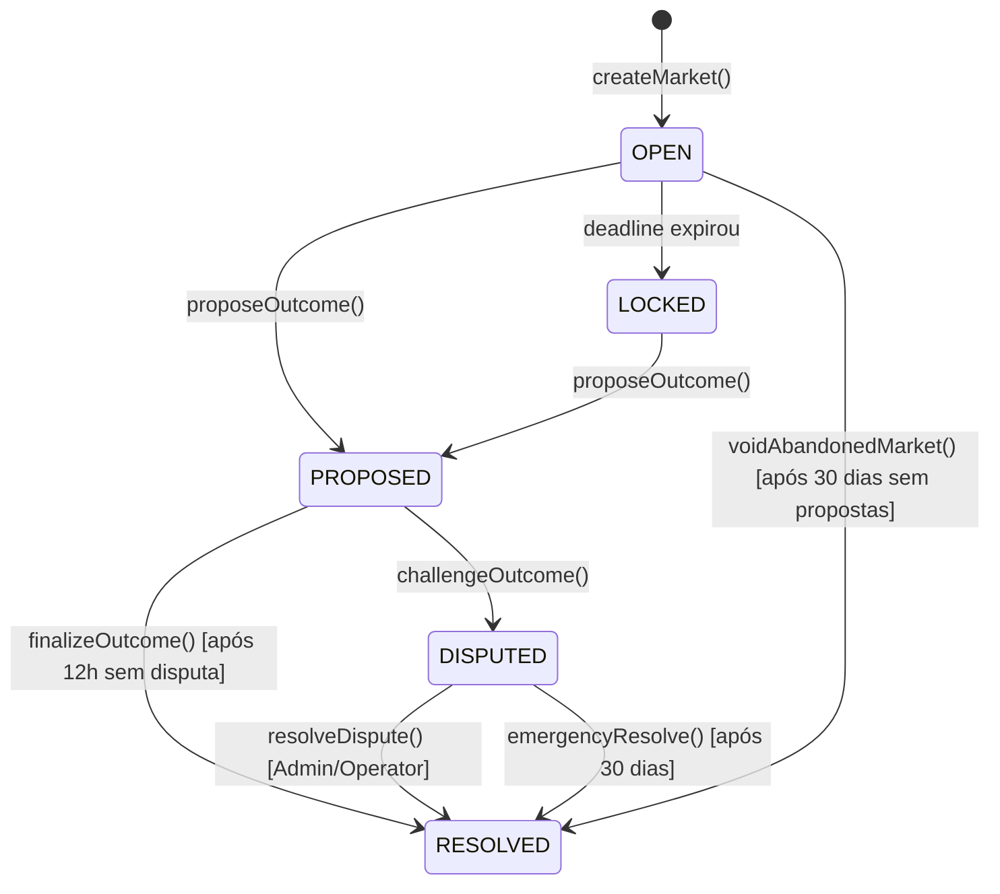

# 🛡️ Solicitação de Auditoria de Segurança: Prediction Battle V9

**Data:** 09 de Fevereiro de 2026  
**Versão do Contrato:** PredictionBattleV9.sol  
**Rede Alvo:** Base Sepolia (Testnet) → Base Mainnet (Produção)  
**Token:** USDC (6 decimais)

---

## 1. Resumo Executivo

O **Prediction Battle** é um protocolo de mercados de previsão descentralizado onde usuários podem criar mercados sobre eventos do mundo real, apostar em resultados (YES/NO) e ganhar recompensas. O protocolo implementa um sistema de verificação descentralizada com bonds econômicos e janelas de disputa.

### 🎯 O Que Este Contrato Faz

1. **Criadores** depositam um "Seed" (garantia) para criar um mercado com uma pergunta.
2. **Apostadores** depositam USDC escolhendo YES ou NO.
3. **Verificadores** propõem o resultado com um Bond de garantia.
4. **Contestadores** podem disputar a proposta apresentando contra-evidência.
5. **Vencedores** recebem os fundos do pool (menos taxas).
6. **Criadores** recuperam 100% do Seed após a resolução.

---

## 2. Arquitetura do Sistema

### 2.1 Máquina de Estados



### 2.2 Resultados Possíveis (`MarketOutcome`)

| Enum | Estado | Descrição | Taxas |
|------|--------|-----------|-------|
| 0 | PENDING | Não resolvido ainda | - |
| 1 | YES | Resultado SIM venceu | 21% |
| 2 | NO | Resultado NÃO venceu | 21% |
| 3 | DRAW | Empate técnico | 20% |
| 4 | CANCELLED | Cancelamento administrativo | 0% |

---

## 3. Mecânica Econômica

### 3.1 Estrutura de Taxas (Fee-on-Resolution)

**Importante:** Taxas são deduzidas **apenas na saída** (claim), não na entrada (bet).

| Destinatário | Percentual | Quando |
|--------------|------------|--------|
| House (Treasury) | 10% | Claim |
| Creator | 5% | Claim |
| Referrer | 5% | Claim (se existir, senão → House) |
| Reporter | 1% | Claim separado |
| **Total** | **21%** | |

### 3.2 Seed Recuperável (Inovação V9)

O Seed do Criador **NÃO** é liquidez de apostas. Ele funciona como um **Depósito de Garantia**:

1. Criador deposita Seed → Armazenado em `m.seedAmount` (separado do pool).
2. Pool de apostas (`m.totalYes` + `m.totalNo`) começa em ZERO.
3. Após resolução (qualquer resultado), Criador pode chamar `withdrawSeed()` para recuperar 100%.
4. **Benefício:** Zero risco para criadores. Incentiva criação de mercados.

### 3.3 Fluxo de Fundos e Solvência

O contrato rastreia todos os passivos via `totalLockedAmount`:

```
ENTRADAS (incrementam totalLockedAmount):
  ├── createMarket: +seedAmount
  ├── placeBet: +betAmount
  ├── proposeOutcome: +bondAmount
  └── challengeOutcome: +challengeBondAmount

SAÍDAS (decrementam totalLockedAmount):
  ├── claimWinnings: -payout
  ├── withdrawSeed: -seedAmount
  ├── withdrawBond: -claimableBonds
  ├── withdrawCreatorFees: -creatorBalance
  ├── withdrawReferrerFees: -rewardsBalance
  ├── withdrawHouseFees: -houseBalance
  └── claimReporterReward: -reward
```

**Invariante de Solvência:**
```
usdcToken.balanceOf(contract) >= totalLockedAmount
```

A função `sweepDust()` permite ao Admin retirar apenas o excedente (`balance - locked`).

---

## 4. Funcionalidades Verificadas (Auditorias Anteriores)

As seguintes funcionalidades foram aprovadas em auditorias anteriores e mantidas:

- ✅ **Reentrancy Guard**: Todas as funções de transferência usam `nonReentrant`.
- ✅ **Access Control**: Roles separadas (Admin, Operator).
- ✅ **Pausable**: Funções críticas podem ser pausadas.
- ✅ **SafeERC20**: Todas as transferências USDC usam SafeERC20.
- ✅ **Bond Dinâmico**: `MIN_BOND + 1% do Pool`.
- ✅ **Rate Limiting**: 1 mercado por hora por criador; 30min cooldown antes de propor.
- ✅ **Circuit Breakers**: Max bet, max pool, max bettors per side.
- ✅ **Early Verification**: Permite propor resultado antes do deadline (se houver cooldown).

---

## 5. Correções Implementadas (ECR-002)

### 5.1 C-01: Solvência via sweepDust (CRÍTICO)

**Problema Original:** Seed não era rastreado em `totalLockedAmount`, permitindo que `sweepDust` drenasse liquidez.

**Correção:**
```solidity
// createMarket()
usdcToken.safeTransferFrom(msg.sender, address(this), _usdcSeedAmount);
totalLockedAmount += _usdcSeedAmount; // ← ADICIONADO

// withdrawSeed()
totalLockedAmount -= amount; // ← ADICIONADO
```

### 5.2 H-01: Distribuição de Taxas em Vitórias (ALTO)

**Problema Original:** `creatorBalance` e `rewardsBalance` nunca eram incrementados em vitórias YES/NO.

**Correção:** Taxas são distribuídas individualmente durante `claimWinnings`:
```solidity
// claimWinnings() - caso YES/NO
houseBalance += houseFee;
creatorBalance[m.creator] += creatorFee;
if (winningBet.referrer != address(0)) {
    rewardsBalance[winningBet.referrer] += referrerFee;
} else {
    houseBalance += referrerFee; // No referrer = house
}
```

### 5.3 M-01: Smart Wallets Bloqueados (MÉDIO)

**Problema Original:** `require(!_isContract(_referrer))` bloqueava DAOs, Multisigs e Account Abstraction.

**Correção:** Removida a verificação. O padrão pull-payment já mitiga reentrância.

---

## 6. Pontos de Atenção para Auditores

### 6.1 Design Decisions (Não São Bugs)

1. **Taxas Distribuídas por Usuário:** Para eficiência de gas, taxas são calculadas e distribuídas quando cada vencedor chama `claimWinnings`, não uma vez na resolução.

2. **Referrer de Apostas Perdedoras:** O referrer de um perdedor **não** recebe taxa. Apenas referrers de vencedores são recompensados.

3. **Seed Não Afeta Odds:** O Seed não vai para o pool, então as odds iniciais dependem apenas de apostas reais. O primeiro apostador em cada lado recebe shares máximas.

4. **Fallback sem Referrer:** Em `claimFallback` (quando não há vencedores), a taxa de referrer vai para House pois não há um referrer específico associado.

### 6.2 Constantes Importantes

| Constante | Valor | Descrição |
|-----------|-------|-----------|
| DISPUTE_WINDOW | 12 horas | Tempo para contestar |
| EMERGENCY_TIMEOUT | 30 dias | Safety hatch após disputa travada |
| MIN_BET_AMOUNT | 0.05 USDC | Aposta mínima |
| MIN_BOND | 5 USDC | Bond mínimo para propor |
| USDC Address | 0x036CbD...e | Base Sepolia (MUDAR PARA MAINNET!) |

### 6.3 Riscos Conhecidos (Aceitos pelo Protocolo)

1. **Endereço USDC Hardcoded:** Deliberado para evitar dependência de parâmetro mutável. Deve ser alterado manualmente para deploy em mainnet.

2. **Centralização do Operator:** Disputas são resolvidas por um Operator centralizado. Mitigado por `emergencyResolve` (qualquer um pode resolver após 30 dias).

3. **Reentrância em Referrer:** Removemos o bloqueio de contratos para referrers. Um contrato malicioso poderia tentar reentrância em `withdrawReferrerFees`, mas `nonReentrant` e o padrão checks-effects-interactions protegem.

---

## 7. Escopo da Auditoria

### 7.1 Arquivos para Auditar

| Arquivo | Linhas | Prioridade |
|---------|--------|------------|
| contracts/PredictionBattleV9.sol | ~760 | 🔴 CRÍTICO |

### 7.2 Fora do Escopo

- Frontend (Next.js)
- Backend (Vercel KV)
- Scripts de deploy

### 7.3 Checklist de Verificação Sugerido

- [ ] Fluxo completo: Create → Bet → Propose → Finalize → Claim
- [ ] Fluxo de disputa: Propose → Challenge → Resolve
- [ ] Cenário CANCELLED: Refund 100%
- [ ] Cenário DRAW: Refund - 20%
- [ ] Cenário No Winners: `claimFallback`
- [ ] Seed Recovery: `withdrawSeed` funciona para todos os outcomes
- [ ] Solvência: `sweepDust` nunca drena fundos legítimos
- [ ] Fee Distribution: Creator, Referrer, House, Reporter recebem corretamente

---

## 8. Contato

Para dúvidas sobre a lógica de negócio ou decisões de design:

**Projeto:** Prediction Battle  
**Repositório:** [odanilohenrique/prediction-battle](https://github.com/odanilohenrique/prediction-battle)

---

*Documento gerado automaticamente. Última atualização: 09/Fev/2026*
